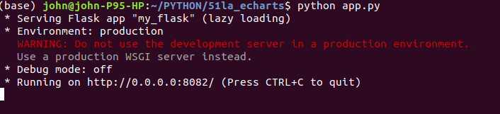
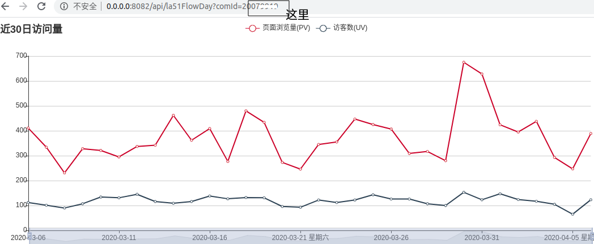
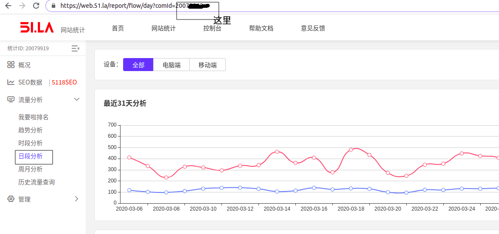
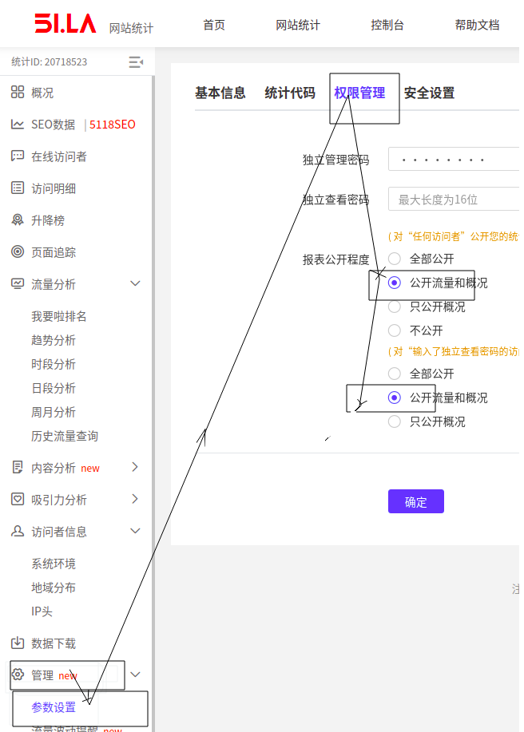

# 51la_echarts
从51抓取数据，绘制访问量图（进30日）,支持iframe形式嵌入到其他网页  
有时需将网页的访问量情况，展示到网页上，而目前的baidu统计，51la统计，均不支持。所以索性自己动手。  

操作系统:ubuntu18.0    
语言:python:3.6  
web:flask框架  

环境搭建  
参考requirments的配置建立conda虚拟环境51la_echarts  
pip install -r requirments.txt  
conda activate 51la_echarts  


启动  
```
git clone https://github.com/yuanjh6/51la_echarts.git
cd 51la_echarts && python app.py
```
如下显示，说明启动成功  
  
之后访问地址(本机为例，如是vps则是vps的IP):  
http://0.0.0.0:8082/api/la51FlowDay?comId=20079919   
  
就是趋势图页面  

注意：  
01,图中部分的变量comId在哪里呢?其实就是这里的变量  
  
02,需要在51la中开启相应数据查看权限  
  
03, 如果需要做echarts样式定制,修改html中样式或者python代码中的返回series数据


